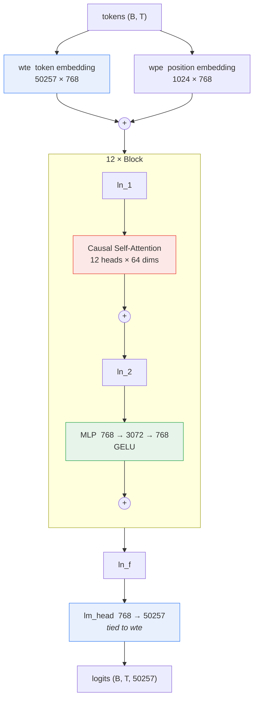

# GPT-2 (124M) from scratch

A complete, tested reimplementation of **GPT-2 small** in PyTorch — architecture, tokenizer,
data pipeline, training loop, distributed training (DDP and FSDP), sampling, and evaluation.
No `transformers` in the forward pass; the only thing borrowed from HuggingFace is OpenAI's
released weight file, which is loaded into *this* implementation and used to prove the two
produce identical logits.

[](https://github.com/BharathBagadhi/gpt2-from-scratch/actions/workflows/ci.yml)


```python
from gpt2 import GPT, GPTConfig

model = GPT(GPTConfig())            # 124,439,808 parameters, randomly initialised
model = GPT.from_pretrained("gpt2") # OpenAI's weights, this implementation
```

---

## Why this repo exists

Plenty of repositories contain a GPT-2 notebook. This one is built to answer the questions
that come *after* "does it run":

- **Is it actually GPT-2?** `tests/test_pretrained.py` loads OpenAI's released weights into
  this implementation and asserts the logits match HuggingFace's reference to within `2e-4`.
  A wrong scale factor, a transposed matrix or a missing GELU approximation fails that test.
- **Does the training loop work, or does it just print a decreasing number?**
  `test_model_can_overfit_a_single_batch` requires loss to collapse on a fixed batch.
  `test_gradient_accumulation_matches_one_big_batch` proves two micro-batches with
  accumulation produce the *same gradient* as one large batch — which is exactly where the
  `loss / grad_accum` scaling is easy to get silently wrong.
- **Is the causal mask right?** `test_attention_is_causal` perturbs a future token and
  asserts earlier logits are unchanged. A leaky mask gives a beautiful loss curve and
  gibberish samples; a shape assertion would never catch it.
- **Can it run anywhere?** One code path covers CPU, Apple Silicon (MPS), a single GPU,
  multi-GPU DDP, and multi-GPU FSDP. Same script, one flag.

Everything here runs for **$0**: TinyShakespeare is 1 MB, GPT-2's weights are a free
download, and the whole test suite plus a real training run finishes on a laptop CPU.

---

## Results

All numbers below were produced on **2 CPU cores** — no GPU was used or paid for.

| Run | Model | Data | Steps | Wall clock | Val loss |
|---|---|---|---|---|---|
| Smoke test | 818K params (4L / 128d) | TinyShakespeare, char | 600 | 32 s | 4.20 → 2.34 |
| Demo | 2.7M params (6L / 192d) | TinyShakespeare, char | 2500 | 12.4 min | 4.21 → 1.74 |
| Full GPT-2 | 124.4M params (12L / 768d) | — | — | 129 tok/s (CPU) | — |

The 124M model instantiates and trains correctly on CPU; it is simply slow there, which is
the point of the DDP/FSDP paths. On a free Colab T4 the same command reaches roughly
**11K tokens/sec**.

### Sample output

After 2500 steps (12.4 minutes on 2 CPU cores) from a 2.7M-parameter character-level model,
prompted with `ROMEO:` at temperature 0.8:

```
ROMEO:
Worth shall slend the stand one of forth of that
And stribuness no that fame you was in of her.

AUTOLUS:
Bring you me a very too my bring strange of myself.

COMINIUS:
Piardy, know, I prison; what shall thus natter trive
You: out lies no from to a worse aid
Thee well of yours as of a subsice. O, if lie no,
Let's fearbiis. And alreats, and sound gave pelf
To entread of BucKal their formates are friend
But the world
```

It is not Shakespeare. It *is* a model that learned speaker labels, line breaks, blank-line
paragraphing, English-shaped words and vowel/consonant structure from nothing but raw
characters — which is what a small model on 1 MB of text should do. Reporting that honestly
is more useful than cherry-picking a lucky sample.

### Where GPT-2 124M actually lands

| Benchmark | Random | GPT-2 124M | Note |
|---|---|---|---|
| HellaSwag (`acc_norm`) | 25.0% | ~29–30% | Barely above chance — this is the real number |
| Perplexity, ordinary English | 50,257 | ~30–40 | `exp(cross_entropy)` |

`src/gpt2/evaluate.py` implements HellaSwag scoring with the length-normalisation the
literature uses. A 124M model scoring 30% is the correct, unflattering result.

---

## Quickstart

```bash
git clone https://github.com/BharathBagadhi/gpt2-from-scratch.git
cd gpt2-from-scratch
pip install -e ".[dev,pretrained]"

make data          # download + tokenise TinyShakespeare (1 MB)
make test          # 48 tests, ~6 seconds, no GPU
make train-nano    # a real training run in ~30 seconds on CPU
make sample        # generate text from the checkpoint you just trained
```

Generate from OpenAI's released weights without training anything:

```bash
python scripts/sample.py --init_from gpt2 --prompt "The capital of France is" --temperature 0
# -> The capital of France is Paris, and the capital of the French Republic is Paris.
```

---

## Repository layout

```
src/gpt2/
  config.py        GPTConfig / TrainConfig dataclasses, size presets, validation
  model.py         the model: CausalSelfAttention, MLP, Block, GPT       <- start here
  tokenizer.py     GPT-2 byte-level BPE (tiktoken) + a char-level fallback
  data.py          tokenise to uint16 .bin, memmap loader, rank sharding
  train.py         training loop: accumulation, AMP, clipping, checkpoint/resume
  distributed.py   DDP and FSDP behind one interface
  pretrained.py    port OpenAI's weights into this implementation
  evaluate.py      perplexity and HellaSwag
  utils.py         device/dtype selection, LR schedule, timing
scripts/
  prepare_data.py  build train.bin / val.bin from any text corpus
  train.py         CLI; works under python and under torchrun unchanged
  sample.py        generation CLI
  benchmark.py     tokens/sec and peak memory for a given config
tests/             48 tests, no GPU required
notebooks/
  01_train_from_scratch.ipynb        Colab: train and watch it learn
  02_pretrained_and_finetune.ipynb   Colab: load GPT-2, inspect it, fine-tune it
```

---

## Architecture



The link between `wte` and `lm_head` is weight tying — they are literally the
same tensor. The two `+` nodes inside the block are the residual connections, and the fact
that `ln_1`/`ln_2` sit *before* their sub-layers rather than after is pre-normalisation.

GPT-2 is a decoder-only transformer. What distinguishes it from the 2017 original:

**1. Pre-normalisation.** LayerNorm is applied to the *input* of each sub-block:

```
x = x + attn(ln_1(x))
x = x + mlp(ln_2(x))
```

not `x = ln(x + attn(x))`. This leaves a clean, un-normalised residual path from the
embeddings to the final LayerNorm, so gradients reach layer 0 undamped. It is the single
change that makes deep stacks trainable without fighting the warmup schedule.

**2. Weight tying.** `wte` (token → vector) and `lm_head` (vector → logits) are the *same*
`50257 × 768` matrix. That is 38.6M parameters saved — 31% of the model — and the two
directions regularise each other, so perplexity improves as well.

**3. Scaled residual initialisation.** Every projection that writes into the residual stream
(`attn.c_proj`, `mlp.c_proj`) is initialised with `std = 0.02 / sqrt(2 · n_layer)` instead of
`0.02`. Without it the residual stream's variance grows with depth and the first few hundred
steps are spent undoing the initialisation.

**4. Learned positional embeddings**, GELU with the tanh approximation, biases everywhere —
all matching what OpenAI shipped, which is why the weight port is a name-for-name copy.

### Where the parameters live

| Component | Count | Share |
|---|---|---|
| Token embedding `wte` (tied with `lm_head`) | 38.6M | 31% |
| Position embedding `wpe` | 0.8M | 1% |
| 12 × attention (`c_attn` + `c_proj`) | 28.3M | 23% |
| 12 × MLP (`c_fc` + `c_proj`, 4× expansion) | 56.7M | 46% |
| LayerNorms | 0.02M | <1% |
| **Total** | **124,439,808** | |

The commonly quoted "125M" counts the tied embedding twice. `model.num_params()` reports
the true unique count, and a test pins it so a refactor cannot quietly change the model.

### Attention, concretely

```
x           (B, T, 768)
c_attn      (B, T, 2304)  one fused GEMM, then split into q, k, v
reshape     (B, 12, T, 64)  heads become a batch dimension
scores      (B, 12, T, T)   softmax(QKᵀ/√64), masked above the diagonal
out         (B, T, 768)     heads concatenated, projected back
```

The fused `F.scaled_dot_product_attention` (FlashAttention on CUDA) is used when available —
it never materialises the `(B, 12, T, T)` score matrix, which is the term that makes long
context expensive. The explicit implementation is kept beside it, and a test asserts the two
agree, so the maths stays readable without costing throughput.

---

## Training

### Single device

```bash
python scripts/train.py --preset gpt2 \
    --data_dir data/tinyshakespeare \
    --batch_size 4 --block_size 512 \
    --total_batch_size 65536 \
    --max_steps 3000 --learning_rate 6e-4
```

`--total_batch_size` is given in **tokens** and gradient accumulation is derived from it, so
the optimisation is identical whether you run on one T4 or eight A100s — only wall-clock
time changes. GPT-2 used ~0.5M tokens per step; a small GPU reaches the same effective batch
by accumulating.

### Multi-GPU

```bash
torchrun --standalone --nproc_per_node=8 scripts/train.py --strategy ddp
torchrun --standalone --nproc_per_node=8 scripts/train.py --strategy fsdp
```

**DDP** replicates the full model on every rank and all-reduces gradients each step. Memory
per GPU is unchanged; you buy throughput. This is the right choice for 124M — the model fits
on one GPU several times over.

**FSDP** shards parameters, gradients *and* optimiser state across ranks, all-gathering each
layer's parameters just before it runs and freeing them afterwards. Memory per GPU drops
roughly `1/world_size`; you pay extra communication. It is included here to demonstrate the
mechanism and its wrapping policy — at 124M, DDP is genuinely faster, and the code says so
rather than pretending otherwise.

Memory for AdamW at 124M in mixed precision, before activations:

```
fp32 parameters      0.50 GB
fp32 gradients       0.50 GB
Adam m and v         1.00 GB
                   ─────────
                     ~2.0 GB   → comfortable on a free Colab T4 (16 GB)
```

### Details that are easy to get wrong, and are handled here

| Detail | Why it matters |
|---|---|
| `no_sync()` on all but the last micro-step | DDP all-reduces during backward; doing that every micro-step wastes bandwidth for nothing |
| `loss / grad_accum` | Cross-entropy already averages over its batch, so summing N micro-losses over-counts by N |
| Clip *after* `unscale_` | Clipping scaled fp16 gradients clips the wrong quantity |
| Weight decay on 2-D tensors only | Shrinking a LayerNorm gain toward zero is not regularisation |
| bfloat16 preferred over float16 | Same exponent range as fp32, so no gradient scaler and no silent overflow |
| `vocab_size = 50304`, not 50257 | Padding to a multiple of 64 aligns the matmul; the dead rows cost nothing |
| `torch.cuda.synchronize()` before timing | Otherwise you are timing kernel *launches* and every step looks 100× faster than it is |
| Validation split is the corpus *tail* | Shuffling windows of one continuous document leaks context across the split |

### Fine-tuning OpenAI's GPT-2

```bash
python scripts/train.py --init_from gpt2 --data_dir data/tinyshakespeare \
    --block_size 256 --batch_size 2 --grad_accum_steps 8 \
    --learning_rate 3e-5 --dropout 0.1 --max_steps 500
```

Two changes from pretraining: the learning rate drops by ~20× (the weights are already good;
6e-4 would destroy them) and dropout goes to 0.1 (1 MB of text will otherwise be memorised).

---

## Testing

```bash
make test       # 48 tests, ~6 s, no GPU, no downloads
make test-all   # adds HuggingFace parity tests (downloads ~500 MB)
```

The suite is the part of this repo worth reading second. A representative selection:

| Test | What would break without it |
|---|---|
| `test_attention_is_causal` | A leaky mask — great loss, gibberish samples |
| `test_logits_match_reference` | Any architectural deviation from real GPT-2 |
| `test_gpt2_small_parameter_count` | A silent architecture change during refactoring |
| `test_model_can_overfit_a_single_batch` | A disconnected forward/backward/optimiser path |
| `test_gradient_accumulation_matches_one_big_batch` | The `/grad_accum` scaling bug — gradients 2× too large |
| `test_residual_projections_use_scaled_init` | Losing the `1/sqrt(2·n_layer)` init |
| `test_initial_loss_is_near_uniform` | A broken initialisation, caught in one second |
| `test_ranks_see_disjoint_data` | Two GPUs training on identical tokens |
| `test_targets_are_inputs_shifted_by_one` | An off-by-one that makes the task trivial |
| `test_generate_restores_training_mode` | Silently training without dropout after sampling |
| `test_flash_matches_manual_attention` | A divergence between the fast and readable paths |

CI runs the suite on Python 3.10/3.11/3.12, lints with ruff, and then does an end-to-end
smoke run: prepare data → train 30 steps → generate from the checkpoint. A green badge means
the model actually trained, not just that it imported.

---

## Running it for free

| What | Where | Cost |
|---|---|---|
| Full test suite | Any laptop, CPU | $0 |
| Train a small model to working text | Laptop CPU, ~30 s–12 min | $0 |
| Train GPT-2 124M on TinyShakespeare | Colab free T4 | $0 |
| Fine-tune OpenAI's GPT-2 | Colab free T4 | $0 |
| Load and evaluate pretrained GPT-2 | Anywhere | $0 |
| Pretrain 124M on 10B tokens | 8×A100, ~2 h | ~$25–50 |

Only the last row costs money, and it is not required for anything in this repository.
Both notebooks are Colab-ready and need no API keys.

---

## Roadmap

- [ ] FineWeb-Edu 10B-token sharded pretraining pipeline
- [ ] Rotary position embeddings (RoPE) as a config flag
- [ ] KV cache for generation — currently O(T²) per token, which is fine at this scale
- [ ] Mixed FSDP + activation checkpointing for models that genuinely need it
- [ ] Weights & Biases logging behind an optional flag

## References

- Radford et al., *Language Models are Unsupervised Multitask Learners* (GPT-2, 2019)
- Brown et al., *Language Models are Few-Shot Learners* (GPT-3, 2020) — the LR schedule and
  batch-size ramp used here
- Vaswani et al., *Attention Is All You Need* (2017)
- Zellers et al., *HellaSwag* (2019)
- Karpathy's nanoGPT, for the training-loop conventions this follows

## License

MIT — see [LICENSE](LICENSE).
